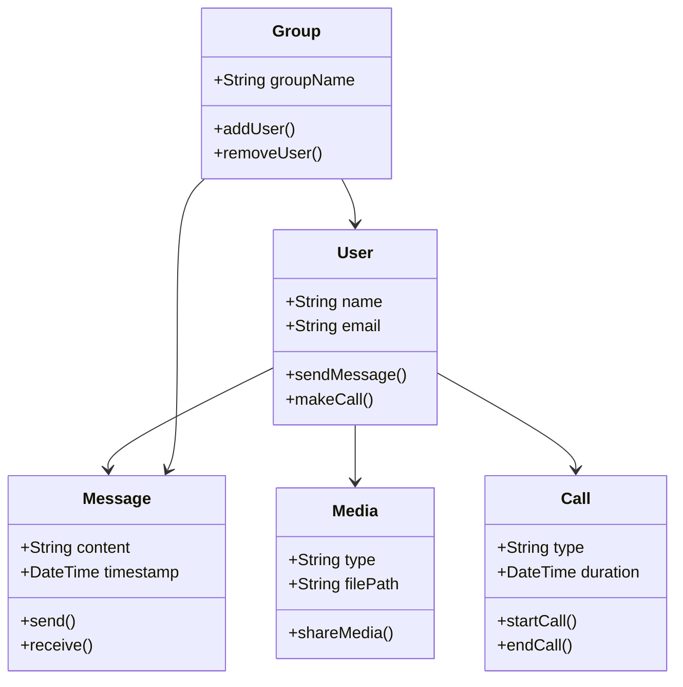

# renald-is-32k

# Facebook Messenger

**Facebook Messenger** — это приложение для обмена сообщениями, разработанное Facebook, которое позволяет пользователям общаться с друзьями и семьёй, обмениваться файлами, звонками и видеосообщениями.

---

## Основные функции

1. **Текстовые сообщения**:
   - Обмен текстовыми сообщениями с друзьями и группами.

2. **Голосовые и видеозвонки**:
   - Возможность совершать бесплатные голосовые и видеозвонки.

3. **Медиа-сообщения**:
   - Обмен изображениями, видео, документами и другими файлами.

4. **Социальные функции**:
   - Возможность создавать групповые чаты и обмениваться реакциями на сообщения.

5. **Боты и интеграции**:
   - Интеграция с различными сервисами, автоматизация с помощью ботов.

---

## UML Диаграммы

### Диаграмма классов (Class Diagram)

--
